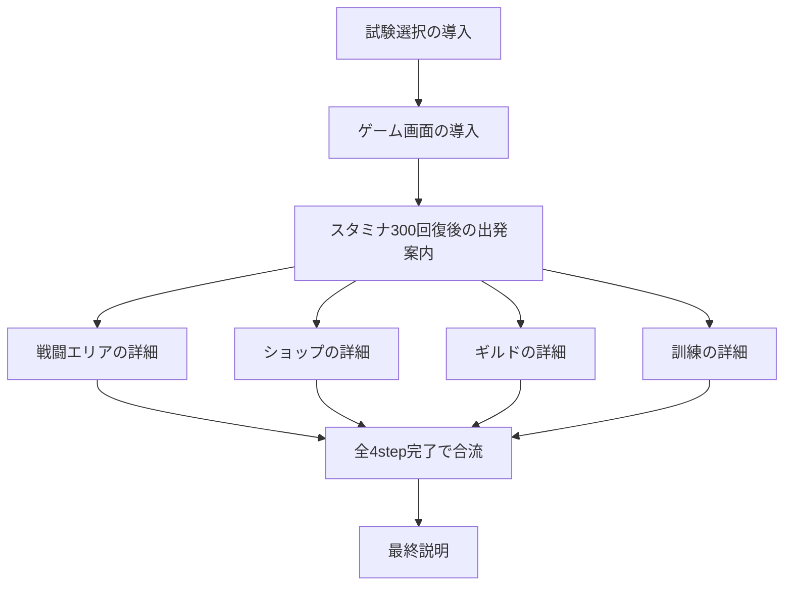

# チュートリアル設計

## 設計の扱い

本書は実装済みチュートリアルの責務、開始条件、stepの接続と表示方法を記録する。会話文面とページ分割は `public/data/text/tutorial.json` を正本とする。

説明候補の項目一覧は、すべてを説明するための要件ではなく、説明漏れを確認するチェックリストとして扱う。オーナーがシナリオを検討し、その具体的な内容と照合して説明済みの項目を消し込み、残った項目のうち説明が必要なものがないか確認する。説明不要の項目を一律に追加しない。

## stepの接続

本書のスタミナ数値はユーザー向け表示単位で記す。表示値300は内部値3に対応する。出発条件や施設消費の内部値・ゲームバランスは変更しない。

## ページ分割と時間停止

- ハイライト対象が変わる箇所では必ずページを切り替える。
- 同じハイライト対象の説明も、長さや会話の流れに応じてAIが適宜ページ分割する。不自然な分割はオーナーの指摘を受けて調整する。
- チュートリアル中はゲームを停止し、チュートリアルから抜けたらチュートリアルによる停止を解除する。カメラ演出とUI描画は停止中も進める。
- 通常の手動一時停止とは独立して管理する。既存GameClockの停止理由にチュートリアル専用の理由を追加する方式を使用できる。
- 終了時に解除するのはチュートリアルの停止理由だけとし、手動一時停止や課題選択など、他の停止理由を勝手に解除しない。他の停止理由がなければゲームを再開する。

## 実装の責務とデータ

- ゲーム側はゲーム状態・到達イベントから開始タイミングを提供する。シナリオID、完了済みstep、前提関係、分岐・合流をゲーム側で判定しない。
- 共通ライブラリのTutorialManagerが、シナリオ定義のtrigger・requiresと保存済み完了状態に基づいて、発火・ページ進行・完了・保存通知を制御する。
- 文面、ページ分割、ハイライト対象、trigger、requiresは`public/data/text/tutorial.json`に定義する。既存のタイミングとハイライト対象を使うシナリオの追加・変更は、ゲームコードを変更せずに行える。ゲームに存在しない新しいタイミングや対象を作る場合だけ、ゲーム側の提供機能を追加する。
- 提供するタイミングは`stage-selection`（課題選択）、`game-screen`（課題選択後のゲーム画面）、`stamina-ready`（準備エリアの仲間の内部スタミナ3以上）、`arrival:<area>`（各エリア到達）、`gameplay`（通常ゲーム画面での判定機会）。合流の完了条件はgameplayのゲーム側処理には置かず、シナリオのrequiresで指定する。
- 進行状態は共通ライブラリのonSaveStateからDataManagerのtutorialStateへ保存し、次回起動時にinitialStateへ渡す。完了済み状態はゲームランをまたいで引き継ぐ。
- リセット後は次の課題選択まで開始タイミングの提供を止める。課題選択で再開した後は通常のtrigger・requires判定を使う。
- 同時到達は到達順で判定機会を保持し、表示中の説明が終了してからライブラリへ通知する。

stepには前提関係があり、並列分岐と合流を持つ。以下のIDはシナリオ定義のIDである。

## 各step

| ID | 表示タイミング・開始条件 | 前提step |
| --- | --- | --- |
| trial-selection-intro | 最初の試験選択のタイミング | なし |
| game-screen-intro | 試験選択後、ゲーム画面に遷移したところ | trial-selection-intro |
| departure-intro | 準備エリアの仲間のスタミナが300まで回復したら | game-screen-intro |
| battle-detail | 仲間が戦闘エリアに到達したとき | departure-intro |
| shop-detail | 仲間がショップに到達したとき | departure-intro |
| guild-detail | 仲間がギルドに到達したとき | departure-intro |
| training-detail | 仲間が訓練エリアに到達したとき | departure-intro |
| final-explanation | 並列の4stepがすべて完了したら表示 | battle-detail、shop-detail、guild-detail、training-detailのすべて |

4つのエリア詳細step同士には前提関係を置かない。到達順に説明でき、特定の順序を要求しない。共通ライブラリの暗黙の直前step依存を使わず、並列stepにはdeparture-introを、最終stepには4つの詳細stepすべてを明示的なrequiresとして指定する。

各stepの説明順序と文面は[会話シナリオ](11.tutorial_scenarios.md)を参照する。

## チュートリアルのカメラ演出

- Canvasのハイライト対象は、通常カメラでは画面外にある可能性がある。そのため、チュートリアル用のパン・ズーム制御を通常操作とは別に用意する。
- 現在の表示からシームレスにつながるよう位置と倍率を補間し、対象に合わせてズームイン・ズームアウトする。対象へ移動したところで説明を表示する。
- ページごとにエリア全体、仲間のチップ、装備表示スロット、掲示などの対象範囲に合わせる。
- 準備エリアは現在のパーティー人数分の表示パネルだけを対象とし、未使用の空き領域を含めない。
- チュートリアル停止中も画面サイズの変更を検出し、現在の対象に対するパン・ズーム、ハイライト、吹き出し位置を再計算する。ページや進行状態は変えない。
- 終了時は、保存した通常カメラの状態に既存の`Camera.setViewport`を適用し、通常のサイズ変更と同じ位置・ズームへ復元する。サイズ変更の有無で処理を分けない。復元演出の途中で再度サイズが変わった場合も再計算する。
- 参考実装はGravityFreightの`src/systems/logic/TutorialCameraFocusController.js`、`TutorialFlowController.js`、`src/systems/core/CameraController.js`。参照のみとし、GravityFreightは変更しない。
- 参考実装では、通常カメラの状態を保存し、ページ表示前の非同期フックで対象範囲への補間移動を待ってから説明を表示する。移動は既定260msのease-in-outであり、複数対象は範囲を合成する。専用のカメラオブジェクトを作る方式ではなく、通常カメラを一時的に制御する方式である。
- 参考実装ではCanvas注目中にカメラ入力をロックし、Canvas対象のないページへの切り替えやシナリオ終了時に保存した状態へ滑らかに戻す。
- 本ゲームでの遷移時間、余白・倍率、通常カメラへの復帰、入力ロックの詳細は実装設計時に検討する。HUDの設定ボタンなどDOM対象はCanvas対象と区別する。

## ギルドマスターのプロフィール

### 説明の表示方法とチップ

- ゼインのチップは使用しない。
- 最初のstepの自己紹介・試験内容説明には、ハイライトするゲーム要素がないため、ハイライトなしで中央付近に表示する。
- ハイライトなしの場合は、ゲーム側で説明パネルの位置を設定し、対象を指す矢印を非表示にする。
- ハイライトありの場合は共通ライブラリの吹き出し位置調整を使用し、対象を指す矢印を表示する。
- 本文だけをスクロールし、タイトル・ページ番号・次へボタンを常に表示する。高さが低い画面ではボタンと余白を小さくして本文の表示量を確保する。
- チュートリアル中はHUDを非表示とする。HUDの設定ボタンを説明するページでは表示し、チュートリアル終了時に通常表示へ戻す。
- 設定のリセット完了時は「チュートリアルの進捗をリセットしました。」と表示する。次に設定を開く際は前回の完了メッセージを消す。リセット処理中はボタンを無効化する。
- 課題選択など対象がある説明では、その対象をハイライトする構成を検討する。
- ゼインの画像・チップ制作は行わない。

確定している役割は、チュートリアルの説明役であり、勇者試験の合格証明書を出す人であること。

- 名前: ゼイン（Zane）。今後のキャラクター追加用にI付近の名前を空け、Zから始まる名前とする。
- 一人称: 私。
- 受験者の呼び方: 君たち。
- 口調: 落ち着いた言い切りを基本にする。「〜だ」「〜する」「〜してくれ」などを使い、確定した導入文面を基準にする。
- それ以外の人物像は未確定。
