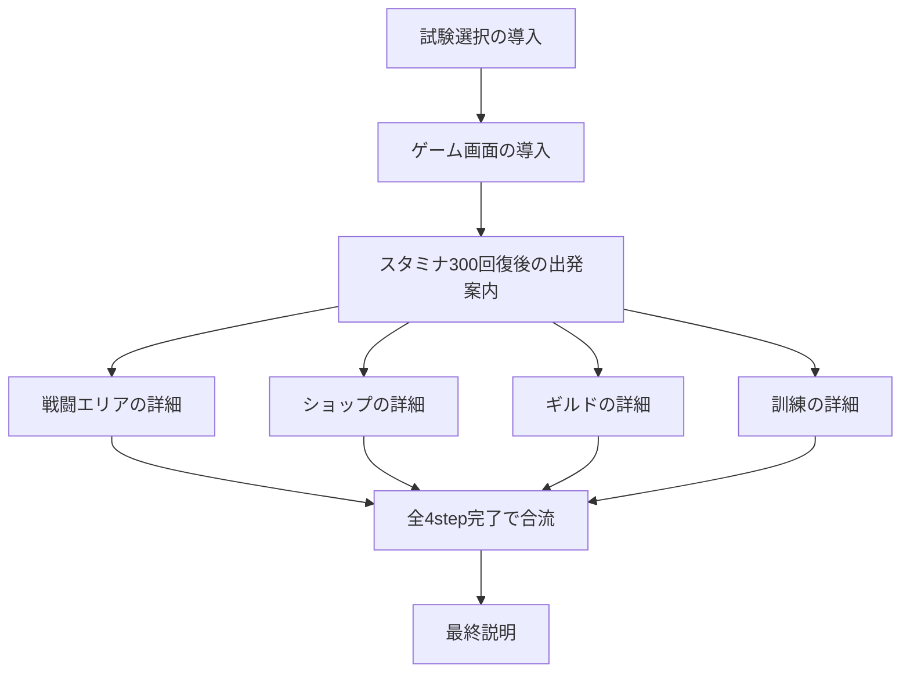

# チュートリアル設計

## 設計の扱い

本書はオーナーと合意したシナリオの流れと、レビュー済みの文面を記録する。未確定のstepの文面とページ分割は今後検討する。文面はstep全体を一続きの会話として検討し、オーナーの草案をAIが清書して、オーナーがレビューする。

説明候補の項目一覧は、すべてを説明するための要件ではなく、説明漏れを確認するチェックリストとして扱う。オーナーがシナリオを検討し、その具体的な内容と照合して説明済みの項目を消し込み、残った項目のうち説明が必要なものがないか確認する。説明不要の項目を一律に追加しない。

## stepの接続

本書のスタミナ数値はユーザー向け表示単位で記す。表示値300は内部値3に対応する。出発条件や施設消費の内部値・ゲームバランスは変更しない。

## ページ分割と時間停止

- ハイライト対象が変わる箇所では必ずページを切り替える。
- 同じハイライト対象の説明も、長さや会話の流れに応じてAIが適宜ページ分割する。不自然な分割はオーナーの指摘を受けて調整する。
- チュートリアル中はゲームを停止し、チュートリアルから抜けたらチュートリアルによる停止を解除する。カメラ演出とUI描画は停止中も進める。
- 通常の手動一時停止とは独立して管理する。既存GameClockの停止理由にチュートリアル専用の理由を追加する方式を使用できる。
- 終了時に解除するのはチュートリアルの停止理由だけとし、手動一時停止や課題選択など、他の停止理由を勝手に解除しない。他の停止理由がなければゲームを再開する。

## 実装の責務とデータ

- ゲーム側はゲーム状態・到達イベントから開始タイミングを提供する。シナリオID、完了済みstep、前提関係、分岐・合流をゲーム側で判定しない。
- 共通ライブラリのTutorialManagerが、シナリオ定義のtrigger・requiresと保存済み完了状態に基づいて、発火・ページ進行・完了・保存通知を制御する。
- 文面、ページ分割、ハイライト対象、trigger、requiresは`public/data/text/tutorial.json`に定義する。既存のタイミングとハイライト対象を使うシナリオの追加・変更は、ゲームコードを変更せずに行える。ゲームに存在しない新しいタイミングや対象を作る場合だけ、ゲーム側の提供機能を追加する。
- 提供するタイミングは`stage-selection`（課題選択）、`game-screen`（課題選択後のゲーム画面）、`stamina-ready`（準備エリアの仲間の内部スタミナ3以上）、`arrival:<area>`（各エリア到達）、`gameplay`（通常ゲーム画面での判定機会）。合流の完了条件はgameplayのゲーム側処理には置かず、シナリオのrequiresで指定する。
- 進行状態は共通ライブラリのonSaveStateからDataManagerのtutorialStateへ保存し、次回起動時にinitialStateへ渡す。完了済み状態はゲームランをまたいで引き継ぐ。
- リセット後は次の課題選択まで開始タイミングの提供を止める。課題選択で再開した後は通常のtrigger・requires判定を使う。
- 同時到達は到達順で判定機会を保持し、表示中の説明が終了してからライブラリへ通知する。

stepには前提関係があり、並列分岐と合流を持つ。以下のIDは設計上の仮IDとする。

## 各step

| 仮ID | 表示タイミング・開始条件 | 前提step |
| --- | --- | --- |
| trial-selection-intro | 最初の試験選択のタイミング | なし |
| game-screen-intro | 試験選択後、ゲーム画面に遷移したところ | trial-selection-intro |
| departure-intro | 準備エリアの仲間のスタミナが300まで回復したら | game-screen-intro |
| battle-detail | 仲間が戦闘エリアに到達したとき | departure-intro |
| shop-detail | 仲間がショップに到達したとき | departure-intro |
| guild-detail | 仲間がギルドに到達したとき | departure-intro |
| training-detail | 仲間が訓練エリアに到達したとき | departure-intro |
| final-explanation | 並列の4stepがすべて完了したら表示 | battle-detail、shop-detail、guild-detail、training-detailのすべて |

4つのエリア詳細step同士には前提関係を置かない。到達順に説明でき、特定の順序を要求しない。共通ライブラリの暗黙の直前step依存を使わず、並列stepにはdeparture-introを、最終stepには4つの詳細stepすべてを明示的なrequiresとして指定する。

### 試験選択の導入

説明順序:

1. ギルドマスターの自己紹介。
2. 試験の内容説明。第7試験まで完了すると合格であり、期限は7日間であることを含む。
3. 試験選択モーダルの説明。

文面（オーナーレビュー済み。以下の3ブロックで記録）:

君たちが今年の勇者認定試験の受験者だな。よく来てくれた。

私はギルドマスターのゼインだ。これから試験について案内する。

大切なことを伝えるので、よく聞いてくれ。

---

これから君たちには、実際にモンスターと戦う実践的な試験を受けてもらう。

課題は全部で7つ。第7試験までクリアーすれば合格だ。

期限は7日間。それを過ぎると不合格になる。試験の期限には気を付けるように。

---

各試験では、3つの課題の中から好きなものを選べる。

最初は簡単な課題を選び、試験に慣れるのがいいだろう。

ただし、簡単な課題ばかり選んでいては、勇者になるのは難しいかもしれないぞ。

さっそく、挑みたい課題を選んでみてくれ。詳しいことは、そのあとで話そう。

チェックリスト消し込み:

- 説明済み: 第7試験まで完了すると合格／期限は7日間／期限切れで不合格／3つの課題からの選択。
- このstepでは未説明: 敵全滅による課題クリアー／貢献ポイント／ギルドでの期限延長。

### ゲーム画面の導入

ゲーム画面の導入は準備エリアと倉庫の説明で一度終了し、スタミナ回復を待って別stepの出発案内へ進む。ステータスバーの列挙、タグの詳細・上限・合算規則、タグスキルの詳しい説明はこの導入から外す。情報の調べ方は出発案内でタップによる確認を紹介する。情報ウィンドウの説明は前半へ移動したため、最終説明では扱わない。

文面:

（ハイライト：準備エリア全体）

ここは受験期間中、君たちが自由に使える準備エリアだ。疲れたらここで休み、スタミナを回復するといい。

ギルドの最新技術で、君たちの能力や状態を数値化して表示している。

---

（ハイライト：倉庫エリア）

ここは君たちのパーティーが共同で使える倉庫だ。

あらかじめ君たちに適した装備を支給しておいたが……。

なんだ！？ 君たちは整理整頓もできないのか？

まあいい、自由に使ってくれ。

試験に備えて、少し休んでくれ。また後で声をかける。

チェックリスト消し込み:

- 説明済み: 準備エリアの役割とスタミナ回復／能力・状態の数値表示／パーティー共有の倉庫／初期装備の支給。

### スタミナ300回復後の出発案内

文面（オーナーレビュー済み）:

（ハイライト：スタミナが回復した仲間のチップ）

早く戦いたくて、うずうずしているようだな。

スタミナが300以上あれば出発できる。自分のチップを倉庫の適当な装備へドラッグしてみるといい。

ただし、いくつか注意がある。

---

（ハイライト：買い物袋）

ショップに行きたいときは、この買い物袋を持っていくように。

装備を格安で支給するので、足りなくなったらショップに行くといいぞ。

---

（ハイライト：延長申請書）

試験の残り期限が心もとないときは、この延長申請書を持ってギルドに来い。

それまでの試験での戦績に応じて、期限を延長してやらんこともない。

---

（ハイライト：勇者仮免許）

強くなりたいなら、この勇者仮免許を持って訓練場へ行くといい。

勇者にふさわしい実力を身につけなければ、試験突破は難しいぞ。

---

（ハイライト：倉庫エリア）

試験場には、買い物袋、延長申請書、勇者仮免許は持ち込めない。試験場へ向かうときは、これらを持たずに来るように。

整理整頓が苦手な君たちのことだ。ちゃんと装備できるのか、少し疑わしいが……。

もし気になるものがあれば、タップしてみるといい。詳しい情報を確認できる。

戦いでは、情報も重要だ。装備や相手のことを知っていれば、有利に戦えるだろう。

まずは自分のチップを倉庫の適当な装備へドラッグして、何か装備してみろ。詳しいことは、そのあとだ。

チェックリスト消し込み:

- 説明済み: 仲間から倉庫装備へのドラッグによる出発／買い物袋とショップの対応・役割／延長申請書とギルドの対応・期限延長／勇者仮免許と訓練場の対応・強化／試験場へは3種の行き先アイテムを持たずに向かう。
- 説明済み: スタミナ300以上で出発可能。
- 説明済み: タップによる詳細情報の確認／装備や相手の情報を知ることの重要性。情報ウィンドウの操作の詳細は未説明。
- 未説明の項目は一律に追加せず、全シナリオ確定後に必要性を確認する。

### エリア詳細（並列の4step）

戦闘エリア、ショップ、ギルド、訓練それぞれで、以下を説明する。

- 何をするエリアなのか。
- そのエリアでの消費スタミナ。

### 戦闘エリアの詳細

表示条件: departure-intro完了後、仲間が試験場に到達したとき。

文面（オーナーレビュー済み）:

（ハイライト：試験場全体）

いよいよ試験開始だ。

ちゃんと装備は整えてきたんだろうな？

---

（ハイライト：到達した仲間に対応する、準備エリアの装備表示スロット）

持っている武器によって、戦い方は変わる。物理攻撃をするもの、魔法攻撃をするもの、仲間を助けるものなど、さまざまだ。

装備には「タグ」が付いているものがある。

タグには、パワーや魔力などのステータスを伸ばすものや、攻撃に炎・水・雷などの属性効果を加えるものがある。

同じタグをたくさんそろえると、その効果が強くなる。タグスキルで得られる能力も強化されるぞ。

武器とタグの組み合わせを考え、装備を厳選するといい。

……厳選できればの話だがな。

ただし、タグがたくさん付いた装備は重くなりがちだ。

重くなると移動が遅くなり、攻撃の間隔も長くなる。あまり重い装備は避けた方がいいかもしれない。

……避けられればの話だがな。

---

（ハイライト：試験場全体）

課題は単純明快。モンスターを全滅させればクリアーだ。

戦闘が始まったら、あとは何も考えずにひたすら戦うだけだ。

ここは試験場だ。モンスターに倒されても、命まで奪われることはない。

スタミナが尽きると装備を失い、準備エリアへ戻る。スタミナを回復して装備を整えれば、何度でも挑めるぞ。

……試験の期限が残っていればの話だがな。

君たちの実力を見せてくれ。

健闘を祈る。

チェックリスト消し込み:

- 説明済み: 武器による物理・魔法攻撃や支援の違い／装備タグによるステータス強化／炎・水・雷の属性効果／同じタグを集める効果とタグスキルの強化／重量による移動速度と攻撃間隔への影響／自動戦闘／敵全滅による課題クリアー。
- 説明済み: スタミナが尽きたときの装備喪失・準備エリアへの帰還／命は奪われないこと／回復・再装備後は期限内で何度でも再挑戦できること。

### ショップの詳細

表示条件: departure-intro完了後、仲間がショップに到達したとき。他のエリア詳細stepの完了は要求しない。

文面（オーナーレビュー済み）:

（ハイライト：ショップエリア）

ほう、買い物に来たか。倉庫の装備だけでは心もとなくなったかな？

ショップに来れば、買い物袋の中身を引き渡す代わりに、装備が2セット、合計10個支給される。

引き渡すものがなくても支給は受けられる。装備を使い果たしても、遠慮せずに来るといい。

ギルドも、君たちを手ぶらで戦わせるつもりはないからな。

---

（ハイライト：ショップの「今回」の掲示）

どんな装備が支給されるかは、この「今回」の掲示を見るといい。

ここに掲げられたタグに傾向を寄せた装備を用意している。

……君たちが欲しいものと合うかは、また別の話だがな。

---

（ハイライト：ショップエリア）

店に引き渡す装備を選びたいなら、出発前にその装備を買い物袋へドラッグしておくといい。

散らかった倉庫からでも、売りたいものくらいは選べるだろう？

ただし、買い物にはスタミナを300消費する。そのとき身につけている装備もなくなる。

買い物を終えたら準備エリアで休み、また装備を整えるといい。

チェックリスト消し込み:

- 説明済み: 買い物袋の中身と装備2セット（10個）の交換／空の袋でも支給を受けられること／今回の販売傾向の掲示／出発前のドラッグによる引き渡す装備の指定／スタミナ300消費／身につけた装備の喪失／準備エリアへの帰還と再準備。

### ギルドの詳細

表示条件: departure-intro完了後、仲間がギルドに到達したとき。他のエリア詳細stepの完了は要求しない。

文面（オーナーレビュー済み）:

（ハイライト：ギルドエリア）

延長申請書を持ってきたか。試験は順調に進んでいるかな？

戦闘で得た貢献ポイントを使えば、試験期限を延ばす申請ができる。

1回の申請で延ばせるのは最大24時間。通常は120ポイントが必要だ。足りなければ、ポイントに応じた時間だけ延長する。

交渉次第では、必要な貢献ポイントを割り引いてやらんこともない。君たちの腕の見せどころだ。

貢献ポイントがなくても、申請すれば1時間は延ばしてやる。

……その1時間をどう使うかは、君たち次第だがな。

申請にはスタミナを300消費し、そのとき身につけている装備もなくなる。戻ったら準備エリアで休み、また装備を整えるといい。

試験の残り期限には、常に注意しておくように。装備や実力が十分でも、期限を過ぎれば不合格だ。

チェックリスト消し込み:

- 説明済み: 戦闘での貢献ポイント獲得／ポイントによる期限延長／1回最大24時間／通常120ポイントで24時間延長／ポイント不足時の延長／交渉による必要ポイントの割引／0ポイントでも最低1時間延長／残り期限への注意。
- 説明済み: 申請でのスタミナ300消費／身につけた装備の喪失／準備エリアへの帰還と再準備。

### 訓練の詳細

表示条件: departure-intro完了後、仲間が訓練エリアに到達したとき。他のエリア詳細stepの完了は要求しない。到達順を前提にしない文面とする。

文面（オーナーレビュー済み）:

（ハイライト：訓練エリア）

腕を磨きに来たか。勇者を目指すなら、日々の鍛錬も大切だ。

訓練では、ステータスの上限を上げられる。今の限界を超えたいなら、ここで鍛えるといい。

訓練にはスタミナを使う。十分にあれば、1回の訓練で上限を複数上げられるぞ。

身につけてきた装備によって訓練の内容が変わり、どのステータスが伸びるかも変わる。

……狙いどおりに鍛えられるかは、君たち次第だがな。

訓練が終わると、身につけていた装備はなくなる。準備エリアで休み、次の出発に備えるように。

チェックリスト消し込み:

- 説明済み: 訓練によるステータス上限の強化／スタミナ消費／十分なスタミナで複数回の強化／装備による訓練内容と伸びる能力の違い／訓練終了時の装備喪失／準備エリアへの帰還と再準備。

### 最終説明

表示条件: battle-detail、shop-detail、guild-detail、training-detailのすべてが完了したら表示する。

文面（オーナーレビュー済み）:

（ハイライト：HUDの設定ボタン）

これで、試験に必要な案内は一通り済んだ。最後に、設定について伝えておこう。

ここから設定を開けば、ゲームの進行速度を変更できる。じっくり考えたいときや、待ち時間を短くしたいときに使うといい。

仲間や敵の頭上に表示する情報も選べる。能力やスタミナ、重量など、確認したいものを表示するといい。常に表示するか、戦闘中だけ表示するかも変更できる。

案内をもう一度聞きたいときは、設定の「チュートリアル」にある「リセット」ボタンを押してくれ。次に課題を選ぶときから、改めて案内する。

……一度で覚えろとは言わん。必要なら、何度でも聞くといい。

それでは、君たちの合格を楽しみにしている。

チェックリスト消し込み:

- 説明済み: HUDから設定を開く／ゲーム進行速度の変更／頭上に表示する情報の選択／常時・戦闘中のみの表示切り替え／チュートリアルのリセット。

リセット後の再開要件:

- リセットボタンを押しても、その場では案内を開始しない。
- 次の課題選択からチュートリアルを再開する。初回だけに限定された開始条件にしない。

## チュートリアルのカメラ演出

- Canvasのハイライト対象は、通常カメラでは画面外にある可能性がある。そのため、チュートリアル用のパン・ズーム制御を通常操作とは別に用意する。
- 現在の表示からシームレスにつながるよう位置と倍率を補間し、対象に合わせてズームイン・ズームアウトする。対象へ移動したところで説明を表示する。
- ページごとにエリア全体、仲間のチップ、装備表示スロット、掲示などの対象範囲に合わせる。
- 準備エリアは現在のパーティー人数分の表示パネルだけを対象とし、未使用の空き領域を含めない。
- チュートリアル停止中も画面サイズの変更を検出し、現在の対象に対するパン・ズーム、ハイライト、吹き出し位置を再計算する。ページや進行状態は変えない。
- 終了時は、保存した通常カメラの状態に既存の`Camera.setViewport`を適用し、通常のサイズ変更と同じ位置・ズームへ復元する。サイズ変更の有無で処理を分けない。復元演出の途中で再度サイズが変わった場合も再計算する。
- 参考実装はGravityFreightの`src/systems/logic/TutorialCameraFocusController.js`、`TutorialFlowController.js`、`src/systems/core/CameraController.js`。参照のみとし、GravityFreightは変更しない。
- 参考実装では、通常カメラの状態を保存し、ページ表示前の非同期フックで対象範囲への補間移動を待ってから説明を表示する。移動は既定260msのease-in-outであり、複数対象は範囲を合成する。専用のカメラオブジェクトを作る方式ではなく、通常カメラを一時的に制御する方式である。
- 参考実装ではCanvas注目中にカメラ入力をロックし、Canvas対象のないページへの切り替えやシナリオ終了時に保存した状態へ滑らかに戻す。
- 本ゲームでの遷移時間、余白・倍率、通常カメラへの復帰、入力ロックの詳細は実装設計時に検討する。HUDの設定ボタンなどDOM対象はCanvas対象と区別する。

## ギルドマスターのプロフィール

### 説明の表示方法とチップ

- ゼインのチップは使用しない。
- 最初のstepの自己紹介・試験内容説明には、ハイライトするゲーム要素がないため、ハイライトなしで中央付近に表示する。
- ハイライトなしの場合は、ゲーム側で説明パネルの位置を設定し、対象を指す矢印を非表示にする。
- ハイライトありの場合は共通ライブラリの吹き出し位置調整を使用し、対象を指す矢印を表示する。
- 本文だけをスクロールし、タイトル・ページ番号・次へボタンを常に表示する。高さが低い画面ではボタンと余白を小さくして本文の表示量を確保する。
- チュートリアル中はHUDを非表示とする。HUDの設定ボタンを説明するページでは表示し、チュートリアル終了時に通常表示へ戻す。
- 設定のリセット完了時は「チュートリアルの進捗をリセットしました。」と表示する。次に設定を開く際は前回の完了メッセージを消す。リセット処理中はボタンを無効化する。
- 課題選択など対象がある説明では、その対象をハイライトする構成を検討する。
- ゼインの画像・チップ制作は行わない。

確定している役割は、チュートリアルの説明役であり、勇者試験の合格証明書を出す人であること。

- 名前: ゼイン（Zane）。今後のキャラクター追加用にI付近の名前を空け、Zから始まる名前とする。
- 一人称: 私。
- 受験者の呼び方: 君たち。
- 口調: 落ち着いた言い切りを基本にする。「〜だ」「〜する」「〜してくれ」などを使い、確定した導入文面を基準にする。
- それ以外の人物像は未確定。
